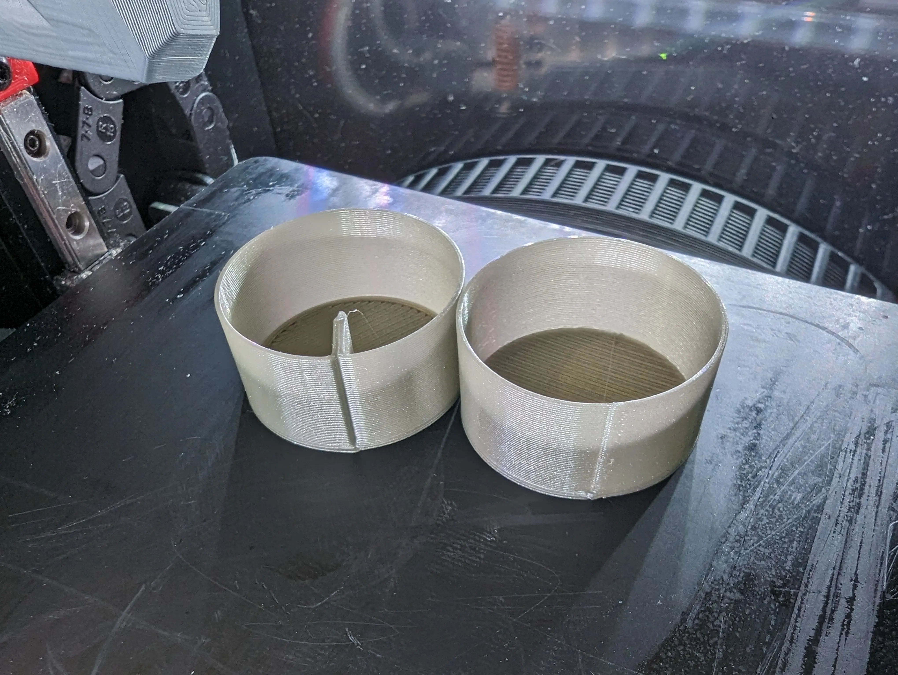

Inspired by a post on [Reddit](https://www.reddit.com/r/3Dprinting/comments/142dmr2/does_anyone_know_of_a_slicer_which_can_hide/) 
of an alternative way to slice seams, and a  desire to play with [FullControlXYZ](https://github.com/FullControlXYZ/fullcontrol)
I made a [notebook](https://colab.research.google.com/github/bithoarder/seam-test/blob/main/seam-test.ipynb) to test this.

It did not work out :)

Experiment on the left, regular sliced on the right:

